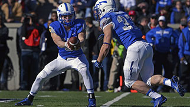

# Alt Text Testing - NVDA Findings + Fixes

Tested using: NVDA + Chrome + Live Server

---

# WCAG Mapping

Principle: Perceivable
Guideline: 1.1 Text Alternatives
SC: 1.1.1 Non-text Content

---

## Case 1: No alt attribute

Failure:

NVDA announces: "Unlabeled graphic"

Why it fails: Screen reader has no information to convey to the user. NVDA cannot guess what the image is about.

Fix: Always add a meaningful alt attribute that describes what the image shows.

---

## Case 2: alt="image" — Useless description

Failure:

NVDA announces: "image Unlabeled graphic"

Why it fails: The word "image" adds no context about what the image actually shows. NVDA is smart enough to flag it as unlabeled even though an alt attribute is present.

Fix: Describe the actual content — answer the question "what is in this image?"

---

## Case 3: Empty alt on a descriptive image

Failure:

NVDA announces: Nothing — skips the image entirely.

Why it fails: Empty alt signals to NVDA that the image is decorative and can be ignored. But football.jpg is meaningful content, so the user misses it entirely.

Fix: Empty alt is valid and correct only for purely decorative images like dividers or background patterns. If the image conveys information, describe it.

---

## Case 4: Filename exposed as alt text

Failure:

NVDA announces: "football.jpg graphic"

Why it fails: Filenames are not human readable descriptions. This is a very common mistake in CMS platforms where alt text is auto-populated with the filename on upload.

Fix: Write a plain human readable description of what the image shows. Never copy the filename into alt.

---

## Case 5: Redundant "image of" prefix

Failure:

NVDA announces: "image of a koala graphic"

Why it fails: NVDA already announces the element as "graphic" after reading the alt text. Saying "image of" at the start is redundant and wastes the user's time by repeating information they already heard.

Fix: Start directly with the description. Skip "image of", "picture of", "photo of" — just describe what is shown.

---

## Key Learnings About NVDA

- NVDA operates in Browse mode and Focus mode
- Browse mode is the default when a page loads — NVDA shortcuts like G work here
- Do not press Tab before testing — it triggers Focus mode and disables NVDA navigation shortcuts
- In Browse mode, press G to jump to next image and Shift+G for previous
- Toggle between modes:`NVDA + Space` 

